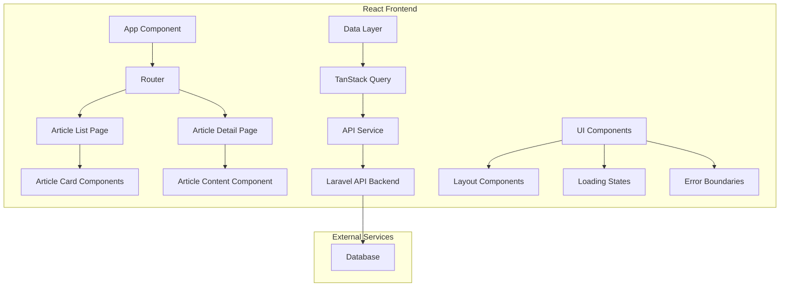
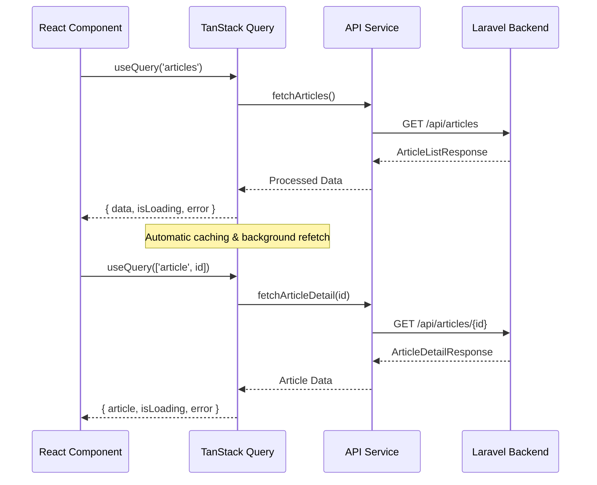

# Design Document

## Overview

The React Article Frontend is a modern, responsive web application built with React 18+ that provides a professional interface for browsing and reading articles from the Laravel API backend. The application follows mobile-first design principles and implements modern React patterns including functional components, hooks, and efficient data fetching strategies.

The system displays both original articles scraped from BeyondChats and their AI-enhanced versions, providing clear visual distinction and seamless navigation between content types. The architecture emphasizes performance, accessibility, and user experience across all device types.

## Architecture

### High-Level Architecture



### Technology Stack

- **Frontend Framework**: React 18+ with functional components and hooks
- **Data Fetching**: TanStack Query (React Query) for server state management
- **Routing**: React Router v6 for client-side navigation
- **Styling**: CSS Modules with CSS Grid and Flexbox for responsive layouts
- **HTTP Client**: Axios for API communication
- **Build Tool**: Vite for fast development and optimized builds
- **State Management**: React built-in state (useState, useContext) + TanStack Query for server state

### Project Structure

```
src/
├── components/
│   ├── common/
│   │   ├── Layout.jsx
│   │   ├── Header.jsx
│   │   ├── Footer.jsx
│   │   ├── LoadingSpinner.jsx
│   │   └── ErrorBoundary.jsx
│   ├── articles/
│   │   ├── ArticleList.jsx
│   │   ├── ArticleCard.jsx
│   │   ├── ArticleDetail.jsx
│   │   ├── ArticleFilter.jsx
│   │   └── ArticleTypeLabel.jsx
│   └── ui/
│       ├── Button.jsx
│       ├── Modal.jsx
│       └── Pagination.jsx
├── services/
│   ├── api.js
│   └── articleService.js
├── hooks/
│   ├── useArticles.js
│   ├── useArticleDetail.js
│   └── useResponsive.js
├── utils/
│   ├── constants.js
│   ├── formatters.js
│   └── validators.js
├── styles/
│   ├── globals.css
│   ├── variables.css
│   └── components/
└── pages/
    ├── HomePage.jsx
    ├── ArticleListPage.jsx
    └── ArticleDetailPage.jsx
```

## Components and Interfaces

### Core Components

#### App Component
- **Purpose**: Root application component with routing and global providers
- **Props**: None
- **State**: Global application state (theme, user preferences)
- **Responsibilities**: 
  - Initialize TanStack Query client
  - Provide routing configuration
  - Handle global error boundaries
  - Manage application-wide context

#### ArticleList Component
- **Purpose**: Display paginated list of articles with filtering
- **Props**: 
  - `filter?: 'all' | 'original' | 'enhanced'`
  - `pageSize?: number`
- **State**: Filter state, pagination state
- **Responsibilities**:
  - Fetch and display articles using TanStack Query
  - Handle loading and error states
  - Implement responsive grid layout
  - Provide article type filtering

#### ArticleCard Component
- **Purpose**: Individual article preview in list view
- **Props**:
  - `article: Article`
  - `onClick: (articleId: string) => void`
- **Responsibilities**:
  - Display article metadata (title, excerpt, date, type)
  - Show visual indicators for article type
  - Handle click navigation to detail view
  - Implement responsive card layout

#### ArticleDetail Component
- **Purpose**: Full article content display
- **Props**:
  - `articleId: string`
- **State**: Article content, loading state
- **Responsibilities**:
  - Fetch and display complete article content
  - Render HTML content safely
  - Display reference citations for enhanced articles
  - Provide navigation back to list

### Data Interfaces

#### Article Interface
```typescript
interface Article {
  id: string;
  title: string;
  content: string;
  excerpt: string;
  type: 'original' | 'enhanced';
  source_url?: string;
  published_at: string;
  created_at: string;
  updated_at: string;
  enhancement_date?: string;
  references?: Reference[];
  original_article_id?: string;
}

interface Reference {
  id: string;
  title: string;
  url: string;
  source: string;
}
```

#### API Response Interfaces
```typescript
interface ArticleListResponse {
  data: Article[];
  meta: {
    current_page: number;
    last_page: number;
    per_page: number;
    total: number;
  };
}

interface ArticleDetailResponse {
  data: Article;
}
```

### Custom Hooks

#### useArticles Hook
- **Purpose**: Manage article list data fetching and caching
- **Parameters**: `{ filter?, page?, pageSize? }`
- **Returns**: `{ articles, isLoading, error, refetch }`
- **Implementation**: Uses TanStack Query for caching and background updates

#### useArticleDetail Hook
- **Purpose**: Fetch individual article details
- **Parameters**: `articleId: string`
- **Returns**: `{ article, isLoading, error }`
- **Implementation**: Caches article details with TanStack Query

#### useResponsive Hook
- **Purpose**: Provide responsive breakpoint information
- **Returns**: `{ isMobile, isTablet, isDesktop }`
- **Implementation**: Uses window resize listeners and media queries

## Data Models

### Article Data Flow



### State Management Strategy

- **Server State**: Managed by TanStack Query
  - Article lists and details
  - Automatic caching with 5-minute stale time
  - Background refetching on window focus
  - Optimistic updates for mutations

- **Client State**: Managed by React hooks
  - UI state (modals, filters, pagination)
  - Form state (search, filters)
  - Navigation state (current page, selected article)

- **Global State**: React Context for shared client state
  - User preferences (theme, layout)
  - Application settings

### Responsive Design System

#### Breakpoints
- **Mobile**: 0px - 767px
- **Tablet**: 768px - 1023px
- **Desktop**: 1024px and above

#### Layout Strategy
- **Mobile-First**: Base styles for mobile, progressive enhancement
- **CSS Grid**: Main layout structure with responsive grid areas
- **Flexbox**: Component-level layouts and alignment
- **Container Queries**: Component-specific responsive behavior

#### Grid System
```css
.article-grid {
  display: grid;
  gap: 1.5rem;
  grid-template-columns: 1fr; /* Mobile */
}

@media (min-width: 768px) {
  .article-grid {
    grid-template-columns: repeat(2, 1fr); /* Tablet */
  }
}

@media (min-width: 1024px) {
  .article-grid {
    grid-template-columns: repeat(3, 1fr); /* Desktop */
  }
}
```

## Correctness Properties

*A property is a characteristic or behavior that should hold true across all valid executions of a system—essentially, a formal statement about what the system should do. Properties serve as the bridge between human-readable specifications and machine-verifiable correctness guarantees.*

### Property 1: Application Loading Triggers Data Fetch
*For any* application initialization, the system should automatically trigger an API request to fetch articles from the Laravel backend.
**Validates: Requirements 1.1**

### Property 2: API Failures Display Error Messages
*For any* API request failure scenario, the system should display a user-friendly error message to inform users of the issue.
**Validates: Requirements 1.2, 7.1**

### Property 3: Loading States Show Indicators
*For any* data fetching operation, the system should display a loading indicator while the request is in progress.
**Validates: Requirements 1.3, 7.5**

### Property 4: Article Type Handling
*For any* article data (original or enhanced type), the system should process and display it without errors or data loss.
**Validates: Requirements 1.4**

### Property 5: Article Layout Rendering
*For any* non-empty article collection, the system should render articles in a structured grid or list layout.
**Validates: Requirements 2.1**

### Property 6: Required Article Information Display
*For any* article being displayed, the system should show all required metadata: title, excerpt, publication date, and article type.
**Validates: Requirements 2.2, 3.5**

### Property 7: Article Type Visual Distinction
*For any* pair of original and enhanced articles, the system should render them with visually distinct indicators or styling.
**Validates: Requirements 2.3, 6.1**

### Property 8: Reference Citation Indicators
*For any* article containing reference citations, the system should display appropriate indicators in the article preview.
**Validates: Requirements 2.4**

### Property 9: Pagination for Large Collections
*For any* article collection exceeding the page size limit, the system should provide pagination controls or infinite scroll functionality.
**Validates: Requirements 2.5**

### Property 10: Article Navigation
*For any* article card clicked, the system should navigate to and display the complete article content.
**Validates: Requirements 3.1**

### Property 11: HTML Content Preservation
*For any* article content containing HTML markup, the system should render it correctly while preserving formatting and structure.
**Validates: Requirements 3.2**

### Property 12: Enhanced Article Citations
*For any* enhanced article with references, the system should display citation information at the bottom of the article content.
**Validates: Requirements 3.3**

### Property 13: Return Navigation
*For any* article detail view, the system should provide a mechanism to navigate back to the article list.
**Validates: Requirements 3.4**

### Property 14: Responsive Layout Adaptation
*For any* screen size (mobile: <768px, tablet: 768-1199px, desktop: ≥1200px), the system should adapt its layout appropriately for that breakpoint.
**Validates: Requirements 4.1, 4.2, 4.3**

### Property 15: Touch-Friendly Mobile Navigation
*For any* mobile screen size (<768px), navigation elements should meet touch-friendly size requirements (minimum 44px touch targets).
**Validates: Requirements 4.4**

### Property 16: Typography and Spacing Consistency
*For any* UI components throughout the application, typography styles and spacing values should be consistent according to the design system.
**Validates: Requirements 5.1**

### Property 17: Accessibility Color Contrast
*For any* text and background color combination, the contrast ratio should meet WCAG AA standards (minimum 4.5:1 for normal text).
**Validates: Requirements 5.3, 5.5**

### Property 18: Enhancement Date Display
*For any* enhanced article, the system should display the enhancement date in the article metadata.
**Validates: Requirements 6.2**

### Property 19: Article Type Filtering
*For any* filter selection (all, original, enhanced), the system should display only articles matching that type.
**Validates: Requirements 6.3**

### Property 20: Article Relationship Linking
*For any* article that has both original and enhanced versions, the system should provide visual or navigational links between related articles.
**Validates: Requirements 6.4**

### Property 21: Enhancement Status Display
*For any* article, the system should display appropriate enhancement status and processing information.
**Validates: Requirements 6.5**

### Property 22: Empty State Handling
*For any* scenario where no articles are available, the system should display an appropriate empty state message.
**Validates: Requirements 7.2**

### Property 23: Network Status Indication
*For any* network connectivity change, the system should detect and indicate the current connection status to users.
**Validates: Requirements 7.3**

### Property 24: Retry Mechanism Availability
*For any* failed operation, the system should provide retry buttons or mechanisms for users to attempt the operation again.
**Validates: Requirements 7.4**

### Property 25: Lazy Loading Implementation
*For any* article list with images or heavy content, the system should load content on-demand as it becomes visible rather than loading everything upfront.
**Validates: Requirements 8.1**

### Property 26: API Response Caching
*For any* identical API request made within the cache duration, the system should serve the response from cache rather than making a new network request.
**Validates: Requirements 8.2**

## Error Handling

### Error Boundary Strategy
- **Global Error Boundary**: Catches unhandled React errors and displays fallback UI
- **Component-Level Error Handling**: Specific error states for data fetching and user interactions
- **API Error Handling**: Structured error responses with user-friendly messages

### Error Types and Responses
1. **Network Errors**: Display retry mechanism with offline indicator
2. **API Errors**: Show specific error messages based on HTTP status codes
3. **Validation Errors**: Inline form validation with clear feedback
4. **Runtime Errors**: Error boundary fallback with error reporting option

### Error Recovery Mechanisms
- **Automatic Retry**: TanStack Query handles automatic retries for failed requests
- **Manual Retry**: User-initiated retry buttons for failed operations
- **Graceful Degradation**: Partial functionality when some features fail
- **Error Reporting**: Optional error reporting to help improve the application

## Testing Strategy

### Dual Testing Approach
The application will use both unit tests and property-based tests to ensure comprehensive coverage:

- **Unit Tests**: Verify specific examples, edge cases, and error conditions
- **Property Tests**: Verify universal properties across all inputs using property-based testing
- Both approaches are complementary and necessary for comprehensive coverage

### Unit Testing Focus Areas
- **Component Rendering**: Verify components render correctly with various props
- **User Interactions**: Test click handlers, form submissions, and navigation
- **Edge Cases**: Empty states, error conditions, and boundary values
- **Integration Points**: API service integration and routing behavior

### Property-Based Testing Configuration
- **Testing Library**: Use `@fast-check/jest` for property-based testing in React
- **Minimum Iterations**: 100 iterations per property test for thorough coverage
- **Test Tagging**: Each property test references its design document property
- **Tag Format**: `// Feature: react-article-frontend, Property {number}: {property_text}`

### Property Test Implementation Strategy
Each correctness property will be implemented as a property-based test that:
1. Generates random but valid input data
2. Executes the system behavior
3. Verifies the expected property holds true
4. Reports counterexamples when properties fail

### Testing Tools and Libraries
- **Unit Testing**: Jest + React Testing Library
- **Property Testing**: @fast-check/jest for generating test data
- **E2E Testing**: Playwright for end-to-end user workflows
- **Accessibility Testing**: @axe-core/react for automated accessibility checks
- **Performance Testing**: React DevTools Profiler for performance regression detection

### Test Coverage Requirements
- **Unit Test Coverage**: Minimum 80% code coverage for components and utilities
- **Property Test Coverage**: All 26 correctness properties must have corresponding tests
- **Integration Coverage**: All API endpoints and routing paths tested
- **Accessibility Coverage**: All interactive elements tested for WCAG compliance

### Continuous Testing Strategy
- **Development**: Tests run on file changes with hot reloading
- **Pre-commit**: All tests must pass before code commits
- **CI/CD Pipeline**: Automated test execution on pull requests and deployments
- **Performance Monitoring**: Regular performance regression testing